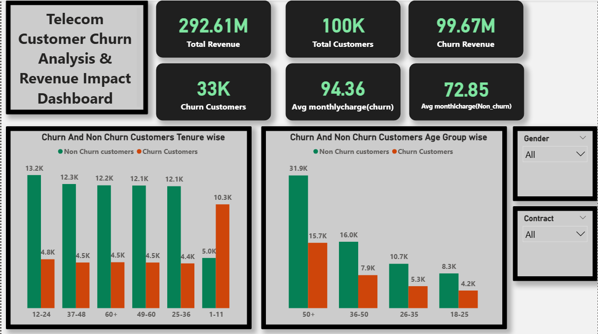
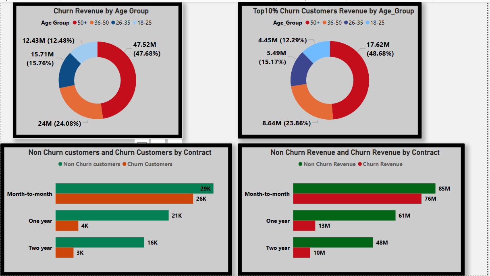
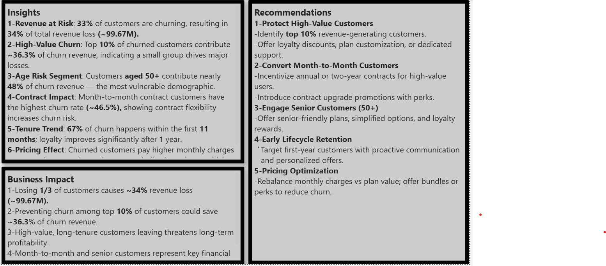

#### Telecom Customer Churn Analysis

## Project Description
This project analyzes a telecom company’s customer data to understand churn patterns, identify high-risk customer segments, and provide actionable recommendations to reduce churn. Using Python, SQL, and Power BI, the project combines statistical analysis, revenue impact assessment, and visualization to help the company retain high-value customers.

## Dataset
The dataset contains information about 100,000 telecom customers including demographics, contract details, tenure, monthly charges, total charges, and churn status.

**Source:** [Kaggle - Telco Customer Churn](https://www.kaggle.com/datasets/dhrubangtalukdar/telco-customer-churn-data)

## Business Problem / Objective
- Identify factors that influence customer churn (e.g., monthly charges, contract type, tenure, age).  
- Quantify revenue loss due to churn.  
- Highlight high-value churn customers contributing most to revenue loss.  
- Provide actionable recommendations to improve customer retention.  

## Analysis & Methods
- Exploratory Data Analysis (EDA) with Pandas, Seaborn, and Matplotlib.  
- **Hypothesis Testing:**  
  - T-test for monthly charges vs churn  
  - Chi-square test for contract type and tenure vs churn  
- Revenue Impact Analysis to calculate total and churned revenue.  
- SQL Analysis: views for top churn customers, age-wise churn, tenure-based churn.  
- RFM Analysis & Power BI Dashboard for visualization and business insights.  

## Key Insights
- **Churn Rate:** 33% of customers have churned.  
- **Revenue at Risk:** Churned customers account for 34% of total revenue (~99.67M).  
- **High-Value Churn:** Top 10% of churned customers contribute ~36.3% of churn revenue.  
- **Age Risk Segment:** Customers aged 50+ contribute ~48% of churn revenue.  
- **Contract Impact:** Month-to-month contracts have the highest churn (~46.5%).  
- **Tenure Trend:** 67% of churn occurs within the first 11 months.  
- **Pricing Effect:** Churned customers pay higher monthly charges (~94.36) than non-churned (~72.85).  

## Recommendations
- **Protect High-Value Customers:**  
  - Identify top 10% revenue-generating customers  
  - Offer loyalty discounts, plan customization, or dedicated support  

- **Convert Month-to-Month Customers:**  
  - Incentivize annual or two-year contracts  
  - Introduce contract upgrade promotions with perks  

- **Engage Senior Customers (50+):**  
  - Offer senior-friendly plans, simplified options, and loyalty rewards  

- **Early Lifecycle Retention:**  
  - Target first-year customers with proactive communication and personalized offers  

- **Pricing Optimization:**  
  - Rebalance monthly charges vs plan value  
  - Offer bundles or perks to reduce churn  

## Project Structure
Telecom-Customer-Churn-Analysis/
├─ Python/ # Jupyter Notebook with full analysis
│ └─ telecome.ipynb
├─ SQL/ # SQL scripts & views
│ └─ Telecom Customer Churn Analysis.sql
├─ Power BI/ # Dashboard
│ └─ Telecom Customer Churn Analysis & Revenue Impact Dashboard.pbix
├─ Screenshots/ # Key visualizations
│ ├─ Churn Overview.png
│ ├─ Churn Impact.png
│ └─ Insights, Business Impact & Recommendation.png
└─ README.md # Project description and instructions

## Screenshots
[
[
[ 

## How to Run
1. Clone the repository.  
2. Download the dataset from [Kaggle](https://www.kaggle.com/datasets/dhrubangtalukdar/telco-customer-churn-data).  
3. Open `Python/telecome.ipynb` in Jupyter Notebook.  
4. Run the notebook cells sequentially to reproduce the analysis.  
5. Optional: Open `Power BI/Telecom Customer Churn Analysis & Revenue Impact Dashboard.pbix` to explore interactive dashboards.
